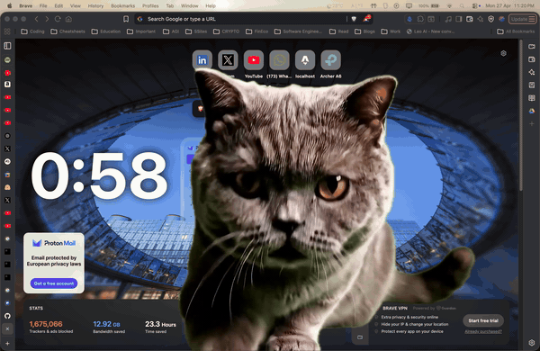

# pomocat

> Pomodoro break reminder for macOS. After 25 minutes of active work, a fat cat fades onto every monitor with a 5-minute break countdown.



Inspired by [this tweet](https://x.com/i/status/2048404010789687315).

## How it works

```
   ┌──────────────────┐  25 min active  ┌──────────────────┐
   │    WORK          │  ────────────►  │    BREAK         │
   │  accumulator     │                 │  cat overlay     │
   │  (input pauses   │                 │  on all monitors │
   │   if idle >60s)  │  ◄────────────  │  + 5m countdown  │
   └──────────────────┘    5 min        └──────────────────┘
```

- **Activity-aware** — work timer pauses when you step away (no input >60s)
- **Multi-monitor** — cat shows on every screen, frame-synced via one shared `AVPlayer`
- **No chromakey** — cat alpha-extracted with Apple's Vision (`VNGenerateForegroundInstanceMaskRequest`), output as HEVC-with-alpha
- **App-Nap-resistant** — `ProcessInfo.beginActivity` keeps the 1 Hz tick from throttling
- **Auto-launch at login** — managed via `launchctl` LaunchAgent

## Install

```bash
git clone git@github.com:sr1jan/pomocat.git
cd pomocat
scripts/install-launchagent.sh
```

That's it. Pomocat starts running now and at every login.

## Stop

```bash
scripts/uninstall-launchagent.sh
```

## Customize

Durations / idle threshold live in `Sources/pomocat/Config.swift`. Edit, then re-run `scripts/install-launchagent.sh` to rebuild and reload.

## Use a different cat

`Assets/cat.mov` (HEVC-with-alpha) is generated by a Swift tool that uses Apple's Vision framework to extract any subject from a green-screen video — no chromakey tuning required.

```bash
# from a YouTube clip + time range
scripts/make-cat-asset.sh "https://youtu.be/<id>" "0:24" "0:31"

# or from a local file
scripts/make-cat-asset.sh /path/to/clip.mp4
```

Requires `yt-dlp` (`brew install yt-dlp`) for URL inputs.

## Requirements

- macOS 14+ · Swift 5.9+
- `git-lfs` (`brew install git-lfs`) to fetch `Assets/cat.mov` on clone

## License

MIT — see [LICENSE](LICENSE).
